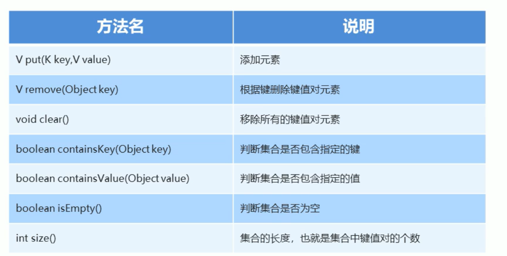
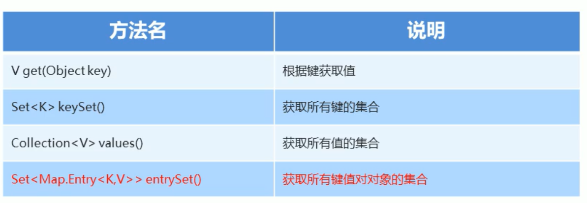

# 集合(java.util.*)


## 体系结构


## Collection集合

### Collection的方法


```
boolean add(E e):添加元素，不能指定位置
```

```
boolean remove(Object obj):移除元素
```

```
void clear():清空集合内的所有元素
```

```
boolean isEmpty():集合是否为空
```

```
int size():集合的长度
```

java`

```java
public class CollectionDemo {
    public static void main(String[] args) {
        /*
         使用多态方式创建Collection对象
        */
        Collection<String> collection = new ArrayList<>();
       
        // boolean add(E e):添加元素
        collection.add("good");
        collection.add("afternoon");
        //boolean remove(Object obj):移除元素
        collection.remove("good");
        //boolean contains(Object o):判断是否存在指定元素
        System.out.println(collection.contains("afternoon"));
        // void chear():清空
        collection.clear();
        //boolean isEmpty():集合是否为空
        System.out.println(collection.isEmpty());
        //int size():集合的长度
        System.out.println(collection.size());

        /*：迭代器依赖集合而存在
            获取迭代器方法：Iterator iterator()
            public Iterator<E> iterator() {
               return new Itr();
           }
            private class Itr implements Iterator<E> {}
           */
        collection.add("hello");
        Iterator<String> iterator = collection.iterator();//多态方法
        while(iterator.hasNext()){
            System.out.println(iterator.next());
        }
    }
}
```

## List集合

### List集合特点

1、有序：存储和取出的元素顺序一致

2、可重复：存储的元素可以重复

### List集合的特有方法

`注意：index越界问题！！`

void add(int index,E element)			在集合的特定位置插入指定元素，原来元素向后移动

E remove(int index)							 删除指定位置元素，并将它返回

E set(int index,E element)				 修改指定位置元素值，返回被修改的元素

E get(int index)									返回指定索引的元素

### 并发修改异常

`java`

```java
List<String> list = new ArrayList<>();
list.add("lily");
list.add("world");
list.add("java");
Iterator<String> iterator = list.iterator();
while(iterator.hasNext()){
    String s = iterator.next();
    if(s.equals("world"))
        list.add("javaee");
}
```

java.util.ConcurrentModificationException

原因：执行add方法，会使实际修改次数+1，而iterator.next()方法会判断实际修改次数和预期修改次数是否相等，不等，则抛出该异常；

`java`

```java
for(int i=0;i<list.size();i++){
    String s = list.get(i);
    if(s.equals("world"))
        list.add("javaee");
    System.out.println(s);
}
```

不会抛出异常，原因：get()方法并不会判断两个值是否相等。

### 列表迭代器

ListIterator listIterator()

特有add方法,会将实际修改值赋值给预期修改值，没有并发异常。

`java`

```java
list.add("hello");
list.add("java");
ListIterator<String> listIterator = list.listIterator();
while(listIterator.hasNext()){
    String s = listIterator.next();
    if(s.equals("hello")) {
        listIterator.add("c");
    }
}
System.out.println(list);//[hello, c, java]
```

`小知识：增强for循环，即for(int i:arr)形式，其内部是一个iterator，因此在使用时注意异常`

### List子类

常用子类：ArrayList、LinkedList。

ArrayList：底层数据结构是数组，查找快，增删慢

LinkedList：底层数据结构是链表，查找慢，增删快

### LinkedList特有方法


`java`

```java
public class LinkedListDemo {
    public static void main(String[] args) {
        LinkedList<String> linkedList = new LinkedList<>();
        linkedList.add("a");
        linkedList.add("b");
        linkedList.add("c");
        //获取头、尾值
        System.out.println(linkedList.getFirst());
        System.out.println(linkedList.getLast());
        //删除头尾值
        System.out.println(linkedList.removeFirst());
        System.out.println(linkedList.removeLast());
        //在头、尾添加值
        linkedList.addFirst("z");
        linkedList.addLast("d");

        //打印
        System.out.println(linkedList);
    }
}
```

## Set集合

特点：

​	1、不包含重复元素

​	2、没有带索引的方法，普通for循环无法完成遍历

### 哈希值

概念：根据对象的地址或字符串或数字算出来的int类型的数值。

特点：

​	1、同一个对象多次调用hashCode()方法返回值一致

​	2、默认下，不同对象的哈希值不同。重写hashCode()方法可以实现不同对象的哈希值相同。

```java
public class HashDemo {
    public static void main(String[] args) {
        Student stu1 = new Student("lily", "beijing", 22);
        System.out.println(stu1.hashCode());//1325547227
        System.out.println(stu1.hashCode());//1325547227
        Student stu2 = new Student("lily", "beijing", 22);
        System.out.println(stu1.hashCode()==stu2.hashCode());//false
        System.out.println("------------");
        //String重写了hashCode()方法
        String s = "hello";
        String s2 = "hello";
        System.out.println(s.hashCode()==s2.hashCode());//true
        String s1 = "hell"+"o";
        System.out.println(s.hashCode()==s1.hashCode());//true
        String s3 = new String("hello");
        System.out.println(s.hashCode()==s3.hashCode());//true
    }
}
```

### HashSet

特点：

​	1、底层数据结构：哈希表

​	2、无序，即不保证存储和取出顺序一致

​	3、不包含重复元素

​	4、没有带索引的方法，普通for循环无法完成遍历

保证元素唯一性：


### LinkedHashSet

特点：

​	1、哈希表和链表实现Set接口，具有可预测的迭代次序；

​	2、链表保证元素有序，即存储和取出顺序一致

​	3、哈希表保证元素唯一，无重复值。

### TreeSet

特点：

​	1、元素有序，这里有序不是说存储和取出顺序一致，而是按照一定的规则进行排序，具体排序方式取决于构造方法

​	·TreeSet()	根据元素的自然排序进行排序

​	·TreeSet(Comparator comparator)	根据指定的比较器排序

​	2、不包含重复元素

​	3、没有带索引的方法，普通for循环无法完成遍历

#### 自然排序接口Comparable

```java
//当使用TreeSet存储Student对象或其他对象时，为了使存储的对象能够自然排序，复写compareTo方法
//方法规则由要求确定
//要求：1、年龄2、姓氏 均从小到大
@Override
public int compareTo(Student o) {
    //字符串就复写了compareTo方法
    return (this.age-o.age)==0?(this.name.compareTo(o.name)):(this.age-o.age);
    //返回0 相等，返回正数 大，返回负数 小
}
```

#### 比较器排序

在构造方法中使用，与自然排序相同效果

```java
TreeSet<Student> ts = new TreeSet<>(new Comparator<Student>() {
    @Override
    public int compare(Student o1, Student o2) {
        return o1.getAge()-o2.getAge()==0?o1.getName().compareTo(o2.getName()):o1.getAge()-o2.getAge();
    }
});
```

## MAP集合

特点：

键是唯一的，由HashMap的哈希表保证；当键重复时，将原来的值覆盖。

### 基本方法：



### 四种获取方法



```java
public static void main(String[] args) {
    Map<String, String> map = new HashMap<String,String>();
    map.put("1701","lily");
    map.put("1702","anan");
    map.put("1703","ge");
    //get方法，返回键对应的值
    System.out.println(map.get("1701"));
    // Collection<V> values() 获取所有的值
    //由于值是可以重复的，返回Collection
    System.out.println(map.values());
    //Set<K> keySet()，由于键唯一返回Set
    System.out.println(map.keySet());
}
```

### 两种遍历方式：keySet及entrySet

```java
public static void main(String[] args) {
    Map<String, String> map = new HashMap<String,String>();
    map.put("1701","lily");
    map.put("1702","anan");
    map.put("1703","ge");
    // Set<K> keySet()，返回map集合的所有键集合
    Set<String> keys = map.keySet();
    for (String key : keys) {
        String value = map.get(key);
        System.out.println(key+"="+value);
    }
    // Set<Map.Entry<K, V>> entrySet()
    Set<Map.Entry<String, String>> entries = map.entrySet();
    for (Map.Entry<String, String> entry : entries) {
        String key = entry.getKey();
        String value = entry.getValue();
        System.out.println(key+"="+value);
    }
}
```

### 集合嵌套

ArrayList集合存储HashMap元素并遍历，HashMap的键值都是String类型。

```java
public class MapDemo4 {
    public static void main(String[] args) {
        HashMap<String, String> map = new HashMap<>();
        map.put("1701","lily");
        map.put("1702","anan");
        map.put("1703","ge");
        ArrayList<HashMap<String,String>> list = new ArrayList<HashMap<String,String>>();
        list.add(map);
        for (HashMap<String,String> hashMap : list) {
            Set<String> keys = hashMap.keySet();
            for (String key : keys) {
                String value = hashMap.get(key);
                System.out.println(key+"="+value);

            }
            System.out.println("-------------");
        }


    }
}
```

HashMap集合存储ArrayList元素并遍历，HashMap的键是String，值是ArrayList；ArrayList的元素是String类型。

```java
public class MapDemo5 {
    public static void main(String[] args) {
        HashMap<String,ArrayList> map = new HashMap<String,ArrayList>();
        ArrayList<String> list = new ArrayList<String>();
        list.add("li");
        list.add("wang");
        list.add("zhang");
        map.put("xingshi",list);
        for (String key : map.keySet()) {
            ArrayList<String> arrayList = map.get(key);
            for (String s : arrayList) {
                System.out.println(key+"="+s);
            }

        }
        }
    }
```

## Collections

针对集合操作的工具类

### 常用方法

```java
public static <T extends Comparable<? super T>> void sort(List<T> list) 
作用：实现对list的升序排序
```

```java
public static void reverse(List<?> list) 
作用：反转list中的元素顺序
```

```java
public static void shuffle(List<?> list)
作用：使用默认的随机源随机排列list
```

